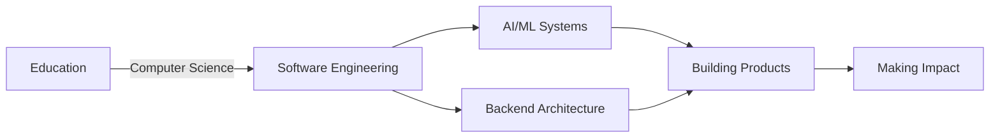

<div align="center">

# Hey, I'm **AZAD**


</div>

<p align="center">
  <a href="https://linkedin.com/in/skajad11014"></a>
  <a href="mailto:azad1.dev0@gmail.com"></a>
  <a href="https://facebook.com/Azad.11014"></a>
  <a href="https://instagram.com/azad.11014"></a>
</p>

---

## About Me

```python
class SoftwareEngineer:
    def __init__(self):
        self.name = "Azad"
        self.role = "Software Engineer"
        self.language_spoken = ["en_US", "hi_IN"]
        
    def say_hi(self):
        print("Thanks for dropping by! Let's build something amazing together.")
        
    @property
    def current_focus(self):
        return [
            "AI-powered SaaS products",
            "LLM systems (RAG, agents, fine-tuning)",
            "Scalable backend architectures",
            "Product-focused development"
        ]
    
    @property
    def philosophy(self):
        return "Great software is simple, scalable, and built for humans"

me = SoftwareEngineer()
me.say_hi()
```

I'm passionate about solving complex problems at the intersection of **AI** and **backend systems**. My work focuses on designing scalable architectures and shipping products that make a real impact. From building LLM-powered applications to crafting robust backend infrastructure, I love turning ambitious ideas into reality.

---

## Professional Journey



- **Current Focus**: AI-powered SaaS & Scalable Backend Systems
- **Learning**: Advanced LLM architectures, System Design at scale
- **Goal**: Build products that solve real-world problems

---

## Tech Stack

<div align="center">

### Languages & Core


### AI/ML & Data Science


### Backend & APIs


### Databases & Caching


### Cloud & Infrastructure


### Message Queues & Tools


</div>

---

## What I'm Up To

- Building **AI-powered SaaS** applications that solve real problems
- Deep diving into **LLM architectures** and **agent-based systems**
- Designing **scalable microservices** and backend infrastructure
- Open to collaborating on **AI/ML projects** and **open source**
- Ask me about **Python, AI/ML, System Design, or Backend Architecture**

---

## Philosophy & Approach

> ### "Great software is **simple**, **scalable**, and built for **humans**"

<div align="center">

```diff
+ Write clean, maintainable code
+ Design for scale from day one
+ Ship products that solve real problems
+ Iterate fast, learn faster
+ Open source when possible
```

</div>

I believe in writing clean, maintainable code that stands the test of time. Every line should serve a purpose, every system should scale gracefully, and every product should delight its users.

---

## Contribution Activity

<div align="center">
  
<picture>
  <source media="(prefers-color-scheme: dark)" srcset="https://raw.githubusercontent.com/Azad11014/Azad11014/output/github-contribution-grid-snake-dark.svg">
  <source media="(prefers-color-scheme: light)" srcset="https://raw.githubusercontent.com/Azad11014/Azad11014/output/github-contribution-grid-snake.svg">
  
</picture>

</div>


## GitHub Stats

<div align="center">
  


</div>

---

## Let's Connect

I'm always excited to connect with fellow developers, discuss new ideas, or explore collaboration opportunities. Whether you want to chat about AI, backend systems, or just say hi — my inbox is open!

<div align="center">

[](mailto:azad1.dev0@gmail.com)
[](https://linkedin.com/in/skajad11014)

**Response time: Usually within 24 hours**

</div>

---

## Support My Work

If you find my projects helpful or interesting, consider buying me a coffee! Your support helps me dedicate more time to building cool stuff and contributing to open source.

<div align="center">

[](https://buymeacoffee.com/Azad_1)

</div>

---

<div align="center">

**⭐ From [Azad11014](https://github.com/Azad11014) | Built with 💙 and ☕**

</div>
