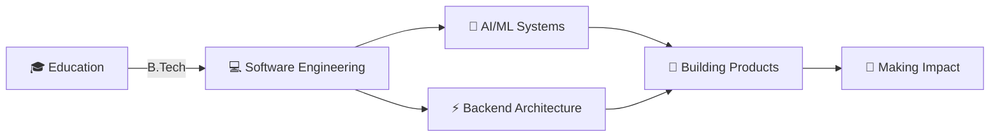

<div align="center">

# Hey 👋, I'm 

</div>

<div align="center">
  
### 

</div>

<p align="center">
  <a href="https://linkedin.com/in/skajad11014"></a>
  <a href="mailto:azad1.dev0@gmail.com"></a>
  <a href="https://facebook.com/Azad.11014"></a>
  <a href="https://instagram.com/azad.11014"></a>
  
</p>

---


### 🚀 Quick Intro

```python
#!/usr/bin/env python3

class Azad:
    def __init__(self):
        self.username = "Azad11014"
        self.role = "Software Engineer"
        self.location = "Kolkata, India 🇮🇳"
        self.education = "B.Tech"
        self.passions = ["AI/ML", "Backend", "Scalability"]
        
    @property
    def current_work(self):
        return {
            "🤖 AI": "Building LLM-powered SaaS products",
            "⚡ Backend": "Designing scalable architectures",
            "🧠 ML": "RAG systems, agents, fine-tuning",
            "🎯 Focus": "Shipping products that matter"
        }
    
    def get_daily_routine(self):
        return "☕ Coffee → 💻 Code → 🚀 Deploy → 🔁 Repeat"
    
    @property
    def philosophy(self):
        return """
        Great software is:
        ✓ Simple yet powerful
        ✓ Scalable by design  
        ✓ Built for humans
        """

# Let's build something amazing! 🚀
dev = Azad()
print(dev.get_daily_routine())
```

<br clear="right"/>

---

## 💼 Professional Journey



- 🎓 **Education**: B.Tech in Information Technology
- 💼 **Current Focus**: AI-powered SaaS & Scalable Backend Systems
- 🌱 **Learning**: Advanced LLM architectures, System Design at scale
- 🎯 **Goal**: Build products that solve real-world problems

---

## 🛠️ Tech Stack & Tools

<div align="center">

### 👨‍💻 Languages


### 🤖 AI/ML & Data Science


### ⚡ Backend & Frameworks


### 🗄️ Databases


### ☁️ Cloud & DevOps


### 🔧 Tools & Other


</div>

---

## 📊 GitHub Stats

<div align="center">
  
  
</div>

<div align="center">
  
</div>

<div align="center">
  
</div>

---

## 🏆 GitHub Trophies

<div align="center">
  
</div>

---

## 🎯 Current Focus

<table>
  <tr>
    <td width="50%">
      
### 🔭 Building
- 🤖 AI-powered SaaS products
- 🧠 LLM-based systems (RAG, agents)
- ⚡ Scalable backend platforms
- 🎯 Product-focused solutions

    </td>
    <td width="50%">
      
### 🌱 Learning
- Advanced LLM architectures
- Distributed systems at scale
- AI agent frameworks
- Cloud-native patterns

    </td>
  </tr>
</table>

---

## 💡 Philosophy & Approach

> ### "Great software is **simple**, **scalable**, and built for **humans**"

<div align="center">

```diff
+ Write clean, maintainable code
+ Design for scale from day one
+ Ship products that solve real problems
+ Iterate fast, learn faster
+ Open source when possible
```

</div>

---

## 🎨 Contributions & Activity

<div align="center">
  


</div>

---

## 🤝 Let's Connect & Collaborate

I'm always excited to discuss:
- 💬 **AI/ML Systems** - LLMs, RAG, agents, fine-tuning
- 🏗️ **System Design** - Scalable architectures & patterns
- ⚡ **Backend Development** - APIs, microservices, databases
- 🚀 **Product Ideas** - Building things that matter
- 🌟 **Open Source** - Collaboration opportunities

<div align="center">

### 📫 Reach Out

[](mailto:azad1.dev0@gmail.com)
[](https://linkedin.com/in/skajad11014)

**Response time: Usually within 24 hours ⚡**

</div>

---

## ☕ Support My Work

If you find my projects helpful or just want to support my caffeinated coding sessions, consider buying me a coffee! Every cup fuels more open source contributions and late-night debugging sessions. 😄

<div align="center">

[](https://buymeacoffee.com/Azad_1)

**Your support = More ☕ = More 💻 = Better 🚀**

</div>

---

<div align="center">

### 💭 Random Dev Quote


---

### 📈 Profile Stats


---


---

**✨ Thanks for visiting! Let's build something amazing together. ✨**


</div>
